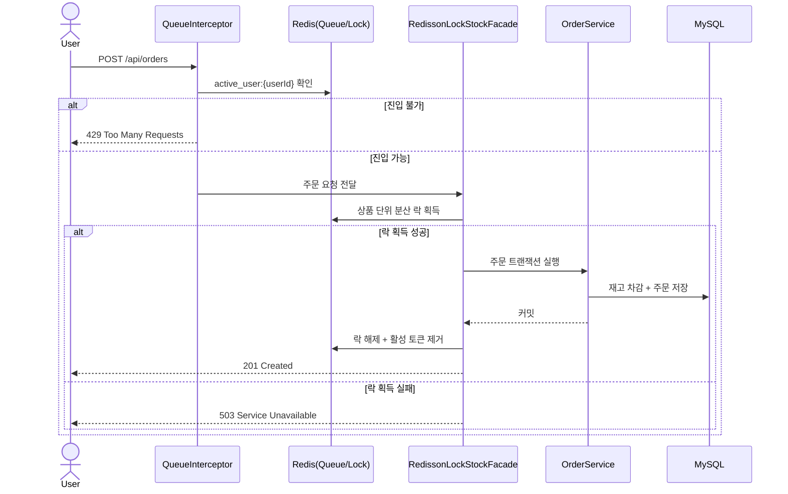

# 🛒 E-Shop Refactoring

> 주문 정합성, 조회 가용성, 깊은 페이지 조회 성능, 캐시 정합성을 실제 테스트로 검증한 Spring Boot 기반 이커머스 백엔드 프로젝트입니다.


## 프로젝트 소개

이 프로젝트는 단순한 쇼핑몰 CRUD 구현보다, **트래픽이 몰릴 때 실제로 문제가 되는 지점**을 개선하는 데 초점을 맞췄습니다.

핵심 질문은 네 가지였습니다.

- 동시에 같은 상품을 주문해도 **재고가 정확하게 유지되는가**
- 락 경쟁이 심해질 때도 **조회 요청이 살아남는가**
- 상품 수가 많아져도 **깊은 페이지 조회가 급격히 느려지지 않는가**
- 캐시를 붙인 뒤에도 **수정 직후 최신 데이터 정합성이 보장되는가**

이를 해결하기 위해 다음 구조를 적용했습니다.

- **주문 정합성**: Redis 분산 락 + `RedissonLockStockFacade`
- **조회 가용성**: 락 대기를 DB 바깥으로 분리해 DB 커넥션 점유 최소화
- **유량 제어**: Redis ZSet 대기열 + TTL 기반 활성 토큰
- **대용량 조회 성능**: QueryDSL 기반 No-Offset 페이지네이션 + `Slice`
- **주문 조회 최적화**: `default_batch_fetch_size=100`으로 N+1 완화
- **캐시 정합성**: `@TransactionalEventListener(AFTER_COMMIT)` 기반 캐시 무효화

## 핵심 개선 포인트

### 1. Redis 분산 락으로 주문 정합성을 제어
주문 생성은 `OrderController -> QueueInterceptor -> RedissonLockStockFacade -> OrderService` 흐름으로 처리됩니다.  
락 획득/해제는 파사드에서 담당하고, 실제 주문 트랜잭션은 서비스에서 짧게 수행하도록 분리했습니다.

### 2. 대기열을 ZSet와 활성 토큰으로 분리
`WaitingQueueService`는 다음 두 키를 사용합니다.

- `waiting_queue` : 대기 순서를 관리하는 ZSet
- `active_user:{userId}` : 진입 허용 여부를 확인하는 TTL 600초 String 키

이 구조 덕분에 주문 요청 시 인터셉터는 `hasKey()` 기반으로 빠르게 진입 여부를 검사할 수 있습니다.

### 3. 주문 목록 조회는 Fetch Join 대신 Batch Fetch 사용
컬렉션 Fetch Join과 페이징을 함께 쓰면 Hibernate가 메모리 페이징으로 전환될 수 있습니다.  
이 프로젝트는 `default_batch_fetch_size=100`을 적용해, 주문 조회 페이징 안정성을 유지하면서 N+1 문제를 줄였습니다.

### 4. 상품 목록은 Offset과 No-Offset을 모두 제공
- `GET /api/products/search` : Offset 기반 `Page`
- `GET /api/products/search/no-offset` : No-Offset 기반 `Slice`

운영성 측면에서 전통적인 페이지 이동과 스크롤형 조회를 모두 비교할 수 있게 분리했습니다.

### 5. 캐시는 조회 속도뿐 아니라 정합성까지 검증
상품 단건 조회는 `@Cacheable("products")`를 사용하고, 수정/재고 변경 시에는 이벤트를 발행한 뒤 `AFTER_COMMIT` 시점에 캐시를 제거합니다.  
즉, 트랜잭션이 롤백되면 캐시 무효화도 실행되지 않도록 구성했습니다.

## 기술 스택

| 구분 | 기술 |
|---|---|
| Language | Java 17 |
| Framework | Spring Boot 3.3.0, Spring Web, Spring Data JPA, Spring Security, Validation |
| Database | MySQL |
| Cache / Lock | Redis, Redisson, ShedLock |
| Query | QueryDSL 5.1.0 |
| Auth | JWT |
| Test | JUnit 5, Spring Boot Test, Spring Security Test, H2, k6 |
| Docs | SpringDoc OpenAPI |
| Infra | Docker, Docker Compose, GitHub Actions, Nginx 기반 배포 스크립트 |

## 아키텍처



## 주요 기능

### 사용자
- 회원가입
- 로그인
- Access Token / Refresh Token 발급
- Refresh Token Redis 저장(`RT:{email}`, TTL 14일)

### 상품
- 상품 등록
- 상품 단건 조회
- 조건 검색
- No-Offset 스크롤 검색
- 가격 수정
- 상품 단건 조회 캐시

### 주문
- 주문 생성
- 내 주문 목록 조회
- 주문 취소

### 대기열
- 대기열 등록 API 제공
- 스케줄러가 1초마다 최대 100명 진입 허용
- 주문 POST 요청에서 대기열 통과 여부 검사

## API 요약

| Method | Path | 설명 | 비고 |
|---|---|---|---|
| POST | `/api/users/signup` | 회원가입 | 공개 |
| POST | `/api/users/login` | 로그인 | 공개 |
| GET | `/api/products/{productId}` | 상품 단건 조회 | 공개 |
| GET | `/api/products/search` | 상품 검색(Page) | 공개 |
| GET | `/api/products/search/no-offset` | 상품 스크롤 검색(Slice) | 공개 |
| POST | `/api/products` | 상품 등록 | `ADMIN` 권한 필요 |
| PATCH | `/api/products/{productId}/price` | 상품 가격 수정 | `ADMIN` 권한 필요 |
| POST | `/api/orders` | 주문 생성 | JWT 필요, 대기열 통과 필요 |
| GET | `/api/orders` | 내 주문 목록 조회 | JWT 필요 |
| PATCH | `/api/orders/{orderId}/cancel` | 주문 취소 | JWT 필요 |
| POST | `/api/orders/queue` | 대기열 등록 | `local`/`dev`/`test` 프로필에서만 활성화, JWT 필요 |

Swagger UI는 `/swagger-ui.html` 경로로 확인할 수 있습니다.

## 실행 방법

### 1) 사전 준비
- Java 17
- Docker / Docker Compose
- MySQL 8
- Redis

### 2) 환경 변수
애플리케이션 실행 전 아래 환경 변수를 설정해야 합니다.

```bash
export DB_PASSWORD=your_db_password
export JWT_SECRET_KEY=your_base64_encoded_jwt_secret
```

### 3) 로컬 인프라 실행
`docker-compose.yml`에는 MySQL과 Redis가 포함되어 있습니다.

```bash
docker compose up -d mysql redis
```

### 4) 애플리케이션 실행
```bash
./gradlew bootRun --args='--spring.profiles.active=local'
```

또는 빌드 후 실행할 수 있습니다.

```bash
./gradlew clean build
java -jar build/libs/eshop-refact-0.0.1-SNAPSHOT.jar --spring.profiles.active=local
```

## 테스트 및 검증

아래 수치는 첨부된 테스트 로그 기준입니다. 실행 시점과 환경에 따라 절대값은 달라질 수 있지만, **비교 방향성과 결과 해석**은 코드와 로그에서 동일하게 확인됩니다.

### 1. 주문 정합성
`OrderConcurrencyIntegrationTest`

- 45명 동시 주문
- 재고 40개 기준
- 성공 40건 / 실패 5건 / 남은 재고 0

초과 주문은 일부 실패했지만, **재고가 음수로 내려가지 않고 최종 재고가 정확히 0으로 유지**됐습니다.

### 2. 조회 가용성
`OrderAvailabilityIntegrationTest`

- DB 비관적 락
  - 총 소요 시간: `418ms`
  - 조회 성공: `0`
  - 조회 실패: `20`
- Redis 분산 락
  - 총 소요 시간: `8766ms`
  - 조회 성공: `20`
  - 조회 실패: `0`

이 테스트는 트랜잭션 내부에 150ms 지연을 넣어 긴 트랜잭션 상황을 재현합니다.  
결과적으로 DB 비관적 락은 더 빨리 끝났지만, **커넥션 풀이 잠겨 조회 트래픽이 모두 실패**했습니다.  
반면 Redis 분산 락은 더 오래 걸렸지만, **조회 요청을 모두 살려 시스템 가용성을 지켰습니다.**

### 3. 락 비용 비교
`OrderConcurrencyIntegrationTest`

- 순수 락 비교
  - DB 비관적 락: `199ms`
  - Redis 분산 락: `432ms`
- 전체 주문 로직 비교
  - DB 락(단순 차감): `67ms`
  - Redis 락(전체 주문): `456ms`

Redis 분산 락은 더 느리지만, 이 프로젝트는 **단일 요청의 속도보다 시스템 전체의 안정성**을 우선하는 방향을 선택했습니다.

### 4. 주문 조회 N+1 완화
`OrderQueryIntegrationTest`

- 기존 구조: 주문 1회 조회 + 주문별 `OrderItem` 추가 조회 = `1 + N`
- 개선 구조: 주문 조회 1회 + `IN` 절 기반 배치 조회 1회 = 총 `2회`

테스트에서는 Fetch Join + 페이징 시 아래 경고가 발생하는 구조도 함께 비교합니다.

```text
HHH90003004: firstResult/maxResults specified with collection fetch; applying in memory
```

즉, 이 프로젝트의 선택은 “무조건 Fetch Join”이 아니라, **페이징 안정성을 유지하면서 N+1을 줄이는 Batch Fetch**입니다.

### 5. 캐시 정합성
`ProductCacheIntegrationTest`

검증 흐름:

- 1차 조회: Cache Miss -> DB 조회 -> Cache Put
- 가격 수정: 캐시 Evict
- 2차 조회: Miss -> 최신 DB 값 조회 -> Cache Put

최종 확인 값은 `20000원`이며, 수정 이후에도 **오래된 캐시가 아니라 최신 값이 다시 적재**되는 것을 확인했습니다.

### 6. 깊은 페이지 조회 성능
`ProductDeepPaginationTest`

- Offset(40만 건 스캔): `33ms`
- No-Offset(인덱스 기반): `25ms`
- 첫 페이지(Offset 0): `5ms`
- 끝 페이지(Offset 40만): `36ms`

또한 로그 기준으로,

- Offset 방식은 `count(...)` 쿼리가 함께 발생
- No-Offset 방식은 `where id < ?` 기반 조회로 `count()` 없이 동작

즉, **뒤 페이지로 갈수록 느려지는 Offset의 특성과 count 쿼리 비용**을 줄이기 위해 No-Offset + `Slice`를 적용했습니다.

## 프로젝트 구조

```text
eshop-refact/
├── src/main/java/com/project/eshop_refact
│   ├── config
│   ├── controller
│   ├── domain
│   ├── dto
│   ├── event
│   ├── exception
│   ├── facade
│   ├── interceptor
│   ├── repository
│   └── service
├── src/main/resources
│   ├── application.yaml
│   ├── application-secret.yaml
│   └── application-sercret.example.yml
├── src/test/java/com/project/eshop_refact
│   ├── controller
│   ├── domain
│   ├── integration
│   ├── service
│   └── stressTest
├── Dockerfile
├── docker-compose.yml
├── docker-compose.prod.yml
├── deploy.sh
├── load-test.js
└── .github/workflows/deploy.yml
```

## 배포

리포지토리에는 운영 배포를 위한 파일도 포함되어 있습니다.

- `Dockerfile`
  - 멀티 스테이지 빌드
  - JRE 런타임 이미지 사용
  - 비루트 사용자(`spring`)로 실행
- `.github/workflows/deploy.yml`
  - `main` 브랜치 push 시 Gradle 빌드
  - Docker Hub 이미지 푸시
  - 원격 서버 접속 후 `deploy.sh` 실행
- `deploy.sh` + `docker-compose.prod.yml`
  - blue/green 컨테이너 교체
  - Nginx upstream 포트 전환
  - Redis + 원격 MySQL(RDS 엔드포인트) 기반 실행

## 참고

- 상품 등록/가격 수정 API는 `ADMIN` 권한이 있어야 호출할 수 있습니다.
- 주문 생성은 JWT 인증만으로 끝나지 않고, 대기열 진입 허용 상태여야 합니다.
- `/api/orders/queue`는 테스트/로컬 성격의 지원 API이므로 `local`, `dev`, `test` 프로필에서만 활성화됩니다.
