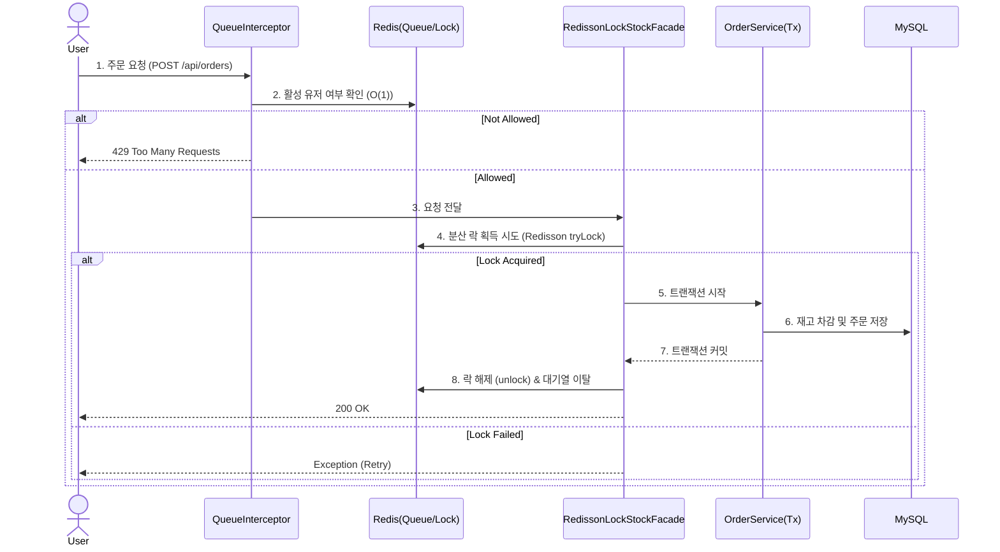

# 🛒 E-Shop Refactoring (High-Traffic Backend)


## 📝 프로젝트 개요
인터넷 이용 시, 서버가 터져서 이용에 불편했던 경험이 있습니다. 개발자를 꿈꾸며 가장 고민했던 부분은 "내가 짠 코드도 만약 많은 사용자가 한 번에 접속해, 동시에 눌러도 버틸 수 있을까?"였습니다.
이 프로젝트는 기존의 단순한 쇼핑몰 로직을 **대규모 트래픽 환경**을 가정하여 리팩토링한 결과물입니다. 동시성 이슈로 재고가 안 맞거나, 쿼리가 느려 DB가 뻗는 상황을 직접 시뮬레이션하고, **Redis 분산 락**과 **No-Offset 페이징** 기술을 도입해 문제를 해결하는 과정에 집중했습니다.

## 🛠 Tech Stack
| Category | Technology | Description |
|---|---|---|
| **Language** | Java 17 | JDK 17 (LTS) |
| **Framework** | Spring Boot 3.x | Spring Security, JPA |
| **Database** | MySQL 8.0, Redis | Prod(MySQL), Cache/Lock(Redis) |
| **Testing** | JUnit5, Mockito | 통합 테스트 위주의 검증 |
## Cloud Infrastructure & CI/CD Pipeline
단순한 기능 구현을 넘어, 실제 서비스 운영에 적합한 안전하고 유연한 인프라 아키텍처를 직접 설계하고 구축했습니다.

### 1. AWS EC2(WAS) & RDS(DB) 물리적 분리 및 보안 아키텍처
   자원 독립성 및 스케일링: WAS와 DB를 하나의 서버에 두지 않고 EC2와 RDS로 물리적으로 분리했습니다. 트래픽 폭증 시 병목 지점에 따라 WAS나 DB를 독립적으로 유연하게 확장할 수 있는 기반을 마련했습니다.

VPC & Private Subnet 기반 보안: RDS는 외부 인터넷에서의 직접 접근을 원천 차단하고, EC2 인스턴스의 특정 보안 그룹을 통해서만 통신할 수 있도록 인바운드 규칙을 설계하여 데이터 보안을 강화했습니다.

### 2. Docker 불변 인프라(Immutable Infrastructure) 및 최적화
   서버에 직접 접속해 코드를 수정하지 않고, OS와 애플리케이션을 하나의 이미지로 굽는 방식을 채택하여 '로컬과 운영 환경의 100% 일치'를 보장했습니다.

멀티 스테이지 빌드: 무거운 빌드 환경(JDK)과 가벼운 실행 환경(JRE)을 분리하여 최종 Docker 이미지 용량을 극단적으로 경량화하고 배포 속도를 높였습니다.

보안 강화 : 컨테이너 내부 프로세스가 root 권한으로 실행되는 보안 취약점을 방지하기 위해, 애플리케이션 전용 유저(spring)를 생성하여 최소 권한 원칙을 적용했습니다.

레이어 캐싱 : 변경 빈도가 낮은 build.gradle을 먼저 복사하고 비즈니스 로직을 나중에 복사하도록 Dockerfile을 최적화하여 빌드 성능을 향상시켰습니다.

### 3. Nginx Blue/Green 무중단 배포 (Zero-Downtime)
   새로운 버전을 배포할 때 발생하는 서버 다운타임을 없애기 위해 GitHub Actions와 Nginx 리버스 프록시를 활용한 CI/CD 파이프라인을 구축했습니다.

GitHub Actions가 코드를 빌드하고 Docker Hub에 이미지를 푸시한 뒤, EC2 내부의 배포 스크립트(deploy.sh)를 자동 실행합니다.

현재 서비스 중인 컨테이너(Blue, 8080)를 유지한 채, 새 버전의 컨테이너(Green, 8081)를 백그라운드에서 실행합니다.

새 컨테이너가 완벽히 부팅되면, **Nginx의 동적 라우팅 변수($service_url)**를 스위칭하고 reload 하여 단 0.1초의 접속 끊김 없이 트래픽을 새로운 버전으로 전환합니다.
## 핵심 아키텍처 및 설계 원칙

### 1. DDD(도메인 주도 설계) 및 객체지향 패러다임 적용
- **DDD (도메인 주도 설계) 및 객체지향 패러다임**
  - 무분별한 Setter 사용을 지양하여 엔티티의 불변성을 보호했습니다.
  - `removeStock`, `cancel` 등 핵심 비즈니스 로직을 Service가 아닌 도메인 엔티티 내부에 응집시켜 캡슐화(Rich Domain Model)를 구현했습니다.
  - 정적 팩토리 메서드(`createOrder`, `createOrderItem`)를 통해 객체 생성과 연관관계 매핑 로직을 일원화했습니다.
- **디자인 패턴을 통한 결합도 완화 (Decoupling)**
  - **Facade 패턴:** `RedissonLockStockFacade`를 도입하여 '락 획득/해제'의 인프라적 관심사와 '재고 차감'이라는 비즈니스 트랜잭션의 관심사를 완벽히 분리했습니다.
  - **Strategy 패턴:** 동시성 제어 방식(일반 차감 vs 비관적 락)을 런타임에 유연하게 교체할 수 있도록 `StockStrategy` 인터페이스를 구현해 OCP(개방-폐쇄 원칙)를 준수했습니다. 
- **스케쥴러 분산 락 제어(ShedLock)**
  - 다중 서버(Scale-out) 환경에서 대기열 통과 스케줄러(QueueScheduler)가 중복 실행되지 않도록 Redis 기반의 ShedLock을 적용하여 데이터 정합성을 보호했습니다.
## Troubleshooting

### 1. DB 커넥션 고갈 방지를 위한 Redis 분산 락 도입
* **상황:** 재고 정합성을 맞추기 위해 `Pessimistic Lock`을 걸었습니다.
* **문제:** 비관적 락(Pessimistic Lock)으로 재고 정합성을 맞출 경우, 락 대기 시간 동안 DB 커넥션이 점유되어 단순 상품 조회나 로그인 요청까지 타임아웃(장애 전파)이 발생하는 현상을 확인했습니다.
* **해결:**
    * 락의 부하를 DB가 아닌 Redis가 감당하도록 **Redisson 분산 락**을 도입했습니다.
    * **Facade 패턴**을 적용해 비즈니스 로직 전후로 락을 제어하여, DB 트랜잭션을 최대한 짧게 유지했습니다.
* **결과:** DB 커넥션 풀을 5개로 제한한 테스트 환경에서도 **조회 API가 100% 성공**하는 것을 확인했습니다.

### 2. O(1) 고속 조회를 위한 유랑 제어(대기열) 토큰 설계
* **상황:** 접속자 대기열을 `Sorted Set` 하나로 구현했습니다.
* **문제:** 매 요청마다 무거운 `ZRANK`(순위 조회) 명령어가 실행되니, 대기 인원이 늘어날수록 Redis CPU 사용량이 급증했습니다.
* **해결:**
    * **입장 가능한 유저는 `Set`으로 분리**했습니다. 이제 인터셉터는 O(logN)이 아닌 **O(1)**(`SISMEMBER`)로 입장 권한을 확인합니다.
    * 유저를 이동시킬 때도 `Pipeline`을 사용하여 네트워크 비용을 줄였습니다.

### 3. 조회 성능 개선 (No-Offset)
* **상황:** 일반적인 `Offset` 페이징으로 상품 목록을 구현했습니다.
* **문제:** 테스트 데이터를 50만 개 넣고 뒷페이지를 조회하니, 앞의 데이터를 다 읽고 버리는 방식(Offset) 때문에 쿼리가 매우 느려졌습니다.
* **해결:**
    * **No-Offset(Cursor-based)** 방식을 도입해, "마지막 조회 ID보다 작은 ID"를 조회하도록 변경했습니다.
* **결과:** 데이터 위치와 상관없이 항상 **일정한 조회 속도(약 10배 향상)**를 확보했습니다.

### 4. 트랜잭션 이벤트(Event-Driven) 기반 캐시 정합성 보장
* **Issue:** 트래픽 분산을 위해 상품 조회에 Look-aside 캐싱을 적용했으나, 데이터 수정 시 트랜잭션 롤백이 발생하면 DB와 Redis 간의 캐시 불일치(Stale Data) 위험이 있었습니다.

* **Solution:** 스프링의 @TransactionalEventListener(phase = TransactionPhase.AFTER_COMMIT)를 활용해 이벤트를 발행하는 구조로 개선했습니다.

* **Result:** 비즈니스 로직 트랜잭션이 DB에 완벽히 커밋된 직후에만 캐시 무효화(Evict)가 실행되도록 보장하여 완벽한 데이터 정합성을 달성했습니다.
## 🏗 System Architecture (Order Flow)
데이터 정합성과 성능의 균형을 맞추기 위해 **대기열(Queue) - 파사드(Facade) - 서비스(Service)** 계층 구조를 적용했습니다.



## 🧪 Testing (검증)
"된다고 생각하는 것"과 "되는 것"은 다르기에, 모든 핵심 로직은 테스트로 증명했습니다.
* [x] **동시성 테스트:** 45명 동시 주문 시 재고 40개 정확히 소진 (성공)
* [x] **가용성 테스트:** DB 커넥션 고갈 시뮬레이션 (성공)
* [x] **성능 테스트:** 대용량 데이터 페이징 속도 비교 (성공)

## 💡 Future Scope
* **High Availability:** 현재 단일 노드로 구성된 Redis를 추후 Redis Cluster로 확장하여 단일 장애점(SPOF) 문제를 극복하고 고가용성을 확보할 계획입니다.

## 🚀 Getting Started
```bash
# 1. Clone Repository
git clone https://github.com/your-repo/eshop-refact.git

# 2. Build
./gradlew build

# 3. Run (Local Profile)
java -jar build/libs/eshop-refact-0.0.1-SNAPSHOT.jar --spring.profiles.active=local
```