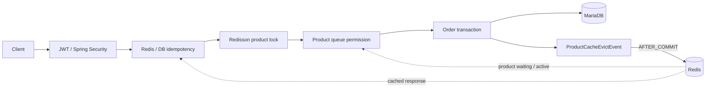

<div align="center">

# E-Shop

### 고트래픽 주문·재고 정합성과 상품 단위 대기열을 검증하는 이커머스 백엔드 PoC

[](https://github.com/juhwanz/eshop-refac/actions/workflows/deploy.yml)
[](https://github.com/juhwanz/eshop-refac/actions/workflows/secret-scan.yml)


[핵심 설계](#핵심-설계) · [빠른 시작](#빠른-시작) · [검증](#검증) · [상세 문서](#상세-문서)

</div>

## 프로젝트 소개

E-Shop은 CRUD 기능의 수보다 **트래픽이 몰릴 때 어떤 불변조건을 지켜야 하는가**에 집중한 Java 21·Spring Boot 기반 이커머스 백엔드 PoC입니다. 재고 정합성, 주문 멱등성, 분산 락의 트랜잭션 경계, 상품 단위 대기열과 캐시 정합성을 실제 MariaDB·Redis 통합 테스트로 검증합니다.

> 이 문서는 2026-09-13 기준 구현 상태를 설명합니다. 로컬 반복 검증 결과는 운영 용량이나 SLO를 의미하지 않으며, 작업 이력은 [개선 로드맵 #27(완료)](https://github.com/juhwanz/eshop-refac/issues/27)에서 확인할 수 있습니다.

## 핵심 설계

| 핵심 문제 | 현재 접근 | 지키려는 조건 |
|---|---|---|
| 재고 정합성 | 상품별 Redisson 락, 도메인 검증, DB CHECK 선언 | 지원 주문 경로의 동시 차감 직렬화와 CHECK 적용 스키마의 음수 재고 저장 차단 |
| 중복 주문 | Redis 처리 표시·응답 캐시, DB 멱등성 키 유일 제약 | 완료 요청의 기존 결과 복구와 실패 요청의 안전한 재시도 |
| 유량 제어 | 상품별 Redis ZSet admission queue와 TTL 활성 권한 | 다른 상품의 혼잡 격리와 주문 상품·활성 권한 일치 |
| 데이터 정합성·조회 | 커밋 이후 캐시 제거, Offset·No-Offset 조회 분리 | 롤백 안전한 캐시와 목적에 맞는 페이지 조회 |



락과 DB 트랜잭션의 경계, 주문·취소 흐름, 대기열과 조회 전략은 [아키텍처 상세](docs/architecture.md)에서 설명합니다. `Product` 매핑의 DB CHECK는 신규 테이블에 생성되며 기존 테이블에는 [별도 적용 절차](docs/stock-protection.md)가 필요합니다.

주요 기술은 Spring Data JPA, QueryDSL, MariaDB, Spring Data Redis, Redisson, Spring Security, JWT, ShedLock, Testcontainers와 GitHub Actions입니다.

## 빠른 시작

Java 21, 로컬 MariaDB 11.8과 Docker가 필요합니다. MariaDB 사용자 생성, JWT 키 준비와 환경변수 설명은 [로컬 실행 가이드](docs/getting-started.md)를 먼저 확인하세요.

```bash
cp .env.example .env
# .env의 DB_PASSWORD와 JWT_SECRET_KEY를 실제 로컬 값으로 변경
./gradlew bootRun --args='--spring.profiles.active=local'
```

로컬 프로필은 호스트 MariaDB에 연결하고 `docker-compose.dev.yml`의 Redis를 애플리케이션 생명주기에 맞춰 실행합니다.

- API 진입점: <http://localhost:8080>
- Swagger UI: <http://localhost:8080/swagger-ui.html>
- Health endpoint: <http://localhost:8080/actuator/health>

인증 조건, 주문 멱등성 헤더와 전체 endpoint는 [API 안내](docs/api.md)를 참고하세요.

## 검증

| 목적 | 명령 | 필요한 인프라 |
|---|---|---|
| 빠른 단위·슬라이스 테스트 | `./gradlew unitTest` | 없음 |
| 단위 테스트와 실행 JAR 검증 | `./gradlew verifyChange` | 없음 |
| 통합·동시성 테스트 | `./gradlew integrationTest` | Docker |

통합 테스트는 Testcontainers의 MariaDB·Redis를 사용합니다. 테스트 분리, CI 범위와 주요 검증이 증명하는 내용은 [테스트와 검증](docs/testing.md)을 참고하세요.

## 상세 문서

| 문서 | 내용 |
|---|---|
| [로컬 실행 가이드](docs/getting-started.md) | 환경변수, MariaDB, Redis와 애플리케이션 실행 |
| [API 안내](docs/api.md) | endpoint, 인증, 멱등성 키와 응답 규격 |
| [아키텍처 상세](docs/architecture.md) | 주문, 락, 대기열, 캐시, 조회와 인증 설계 |
| [주문 멱등성](docs/order-idempotency.md) | 키 계약, DB 유일 제약과 장애 경계 |
| [재고 보호](docs/stock-protection.md) | Redisson watchdog과 DB CHECK 적용 |
| [테스트와 검증](docs/testing.md) | Gradle task, CI와 통합 테스트 |
| [k6 부하 테스트](docs/load-testing.md) | 반복 baseline과 로컬 회귀 기준 |
| [이미지 게시와 참고용 배포](docs/deployment.md) | Docker 이미지, Compose와 배포 한계 |
| [자격 증명 관리와 유출 대응](docs/security/credential-management.md) | 비밀정보 관리와 사고 대응 |
| [Architecture Decision Records](docs/adr/README.md) | 채택한 결정 목록과 작성 규칙 |
