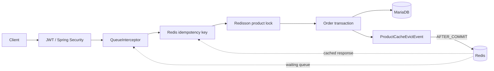

<div align="center">

# E-Shop

### 동시 주문의 재고 정합성과 주문 폭주 상황의 조회 가용성을 함께 다루는 이커머스 백엔드

[](https://github.com/juhwanz/eshop-refac/actions/workflows/deploy.yml)
[](https://github.com/juhwanz/eshop-refac/actions/workflows/secret-scan.yml)


[핵심 설계](#핵심-설계) · [빠른 시작](#빠른-시작) · [API](#api-요약) · [테스트](#테스트와-ci) · [상세 문서](#상세-문서)

</div>

## 프로젝트 소개

E-Shop은 CRUD 기능의 수보다 **트래픽이 몰릴 때 어떤 불변조건을 지켜야 하는가**에 집중한 Spring Boot 기반 백엔드 프로젝트입니다.

- 동시에 같은 상품을 주문해도 실제 재고보다 많이 판매하지 않습니다.
- 분산 락 대기를 DB 트랜잭션 밖에 두어 커넥션 점유 시간을 줄입니다.
- 동일 주문 요청은 사용자별 멱등성 키로 중복 처리를 방지합니다.
- 대기열, 캐시, 깊은 페이지 조회처럼 트래픽 증가 후 드러나는 문제를 함께 다룹니다.
- 보안 검사와 안전한 테스트 범위를 CI에서 자동 검증합니다.

> 이 문서는 2026-09-05 기준 구현 상태를 설명합니다. 진행 중인 개선 순서는 [로드맵 #27](https://github.com/juhwanz/eshop-refac/issues/27)에서 관리합니다.

## 핵심 설계

| 관심사 | 현재 구현 | 지키려는 조건 |
|---|---|---|
| 재고 동시성 | 상품별 Redisson 분산 락 | 재고가 음수가 되거나 초과 판매되지 않음 |
| 트랜잭션 경계 | 락 획득 후 `OrderService` 트랜잭션 진입 | 락 대기 중 DB 커넥션을 점유하지 않음 |
| 주문 멱등성 | Redis `setIfAbsent`, 처리 상태 및 응답 TTL | 완료 요청은 기존 응답 반환, 실패 요청은 재시도 허용 |
| 유량 제어 | Redis ZSet 대기열과 TTL 활성 토큰 | 허용된 사용자만 주문 생성 경로 진입 |
| 캐시 정합성 | `AFTER_COMMIT` 이벤트 기반 상품 캐시 제거 | DB 롤백 시 캐시를 먼저 제거하지 않음 |
| 상품 조회 | QueryDSL Offset `Page` + No-Offset `Slice` | 페이지 이동과 커서 조회 요구를 분리 |
| 주문 조회 | `default_batch_fetch_size=100` | 컬렉션 fetch join 기반 메모리 페이징 회피 |
| 인증 | Stateless JWT, Refresh Token Rotation, Redis blacklist | 토큰 재사용과 로그아웃 토큰 접근 방지 |



주문 처리 순서와 각 경계의 선택 이유는 [아키텍처 상세](docs/architecture.md)에 정리했습니다.

## 기술 스택

| 구분 | 기술 |
|---|---|
| Language | Java 21 |
| Application | Spring Boot 3.3.0, Spring Web, Validation |
| Persistence | Spring Data JPA, Hibernate, QueryDSL 5.1.0 |
| Database | MariaDB 11.8, H2(test) |
| Redis | Spring Data Redis, Redisson 3.31.0, ShedLock 5.13.0 |
| Security | Spring Security, JWT(JJWT 0.11.5) |
| Observability | Spring Boot Actuator, Micrometer |
| API Docs | SpringDoc OpenAPI 2.6.0 |
| Build & Delivery | Gradle Wrapper, Docker, Docker Compose, GitHub Actions |

## 주요 기능

- **사용자**: 회원가입, 로그인, Access/Refresh Token 발급, RTR 재발급, 로그아웃과 Access Token blacklist
- **상품**: 등록, 단건 캐시 조회, 조건 검색, No-Offset 조회, 가격 수정
- **주문**: 멱등 주문 생성, 사용자별 주문 목록, 소유권 검증을 포함한 주문 취소
- **대기열**: Redis ZSet 등록, 1초마다 최대 100명 활성화, ShedLock 기반 중복 스케줄 방지

## 빠른 시작

### 요구사항

- Java 21
- Docker와 Docker Compose

### 1. 환경변수 준비

```bash
cp .env.example .env
```

`.env`에 로컬 환경 값을 설정합니다. 실제 비밀값은 Git에 추가하지 않습니다.

```dotenv
DB_USERNAME=eshop
DB_PASSWORD=change-me
DB_PORT=3306
REDIS_PORT=6380
JWT_SECRET_KEY=base64-encoded-random-key
```

### 2. 로컬 MariaDB 준비

최초 한 번 로컬 MariaDB에 application database와 사용자를 준비합니다. SQL의 비밀번호는 `.env`의 `DB_PASSWORD`와 같아야 합니다.

```bash
sudo mariadb
```

```sql
CREATE DATABASE IF NOT EXISTS eshop CHARACTER SET utf8mb4 COLLATE utf8mb4_unicode_ci;
CREATE USER IF NOT EXISTS 'eshop'@'localhost' IDENTIFIED BY 'change-me';
ALTER USER 'eshop'@'localhost' IDENTIFIED BY 'change-me';
GRANT ALL PRIVILEGES ON eshop.* TO 'eshop'@'localhost';
FLUSH PRIVILEGES;
exit;
```

로컬 프로필로 애플리케이션을 실행하면 Hibernate가 필요한 테이블을 생성하거나 갱신합니다.

### 3. Docker Desktop 실행

Spring Boot는 `docker-compose.dev.yml`의 Redis를 자동으로 시작하고 애플리케이션 종료 시 함께 중지합니다. 기본 Redis 포트는 다른 프로젝트와의 충돌을 피하도록 6380을 사용하며, 필요하면 `.env`의 `REDIS_PORT`를 변경할 수 있습니다.

### 4. 애플리케이션 실행

```bash
./gradlew bootRun --args='--spring.profiles.active=local'
```

`.env`는 애플리케이션과 Docker Compose가 자동으로 읽습니다. Redis 자동 실행을 위해 Docker Desktop은 실행 중이어야 합니다.

- API 진입점: <http://localhost:8080> (Swagger UI로 이동)
- Swagger UI: <http://localhost:8080/swagger-ui.html>
- Health endpoint: <http://localhost:8080/actuator/health> (인증 없이 상태만 공개, 상세 정보 비공개)

로컬 MariaDB 데이터는 기존 MariaDB 저장공간을 사용합니다. 자격 증명 원칙과 유출 대응은 [보안 문서](docs/security/credential-management.md)를 참고하세요.

## API 요약

| Method | Path | 인증 | 설명 |
|---|---|---|---|
| `POST` | `/api/users/signup` | 공개 | 회원가입 |
| `POST` | `/api/users/login` | 공개 | Access/Refresh Token 발급 |
| `POST` | `/api/users/reissue` | 공개 | Refresh Token 검증 및 RTR 재발급 |
| `POST` | `/api/users/logout` | 사용자 | Refresh Token 제거 및 Access Token blacklist |
| `GET` | `/api/products/{productId}` | 공개 | 상품 단건 조회 |
| `GET` | `/api/products/search` | 공개 | 조건 검색과 Offset 페이지 조회 |
| `GET` | `/api/products/search/no-offset` | 공개 | 내림차순 커서 기반 `Slice` 조회 |
| `POST` | `/api/products` | `ADMIN` | 상품 등록 |
| `PATCH` | `/api/products/{productId}/price` | `ADMIN` | 가격 수정 |
| `POST` | `/api/orders/queue` | 사용자 | 대기열 등록, `dev/test/local` 전용 |
| `POST` | `/api/orders` | 사용자 + 대기열 | `Idempotency-Key` 기반 주문 생성 |
| `GET` | `/api/orders` | 사용자 | 내 주문 목록 조회 |
| `PATCH` | `/api/orders/{orderId}/cancel` | 주문 소유자 | 주문 취소와 재고 복구 |

공통 응답은 `ApiResponse`, 오류 응답은 `ErrorResponse` 형식을 사용합니다.

## 테스트와 CI

| 목적 | 명령 | 외부 서비스 |
|---|---|---|
| 빠른 단위·슬라이스 테스트 | `./gradlew unitTest` | 없음 |
| 단위 테스트 + 실행 JAR 검증 | `./gradlew verifyChange` | 없음 |
| 통합·동시성 테스트 | `./gradlew integrationTest` | Docker(Testcontainers MariaDB·Redis) |
| 대량 데이터·깊은 페이지 실험 | `./gradlew stressTest -PallowStressTest` | 로컬 MariaDB, 명시적 승인 필요 |

현재 GitHub Actions는 다음을 수행합니다.

- 모든 push와 PR: 금지 경로 검사, 전체 이력 Gitleaks 검사
- `main` 대상 PR: `./gradlew clean verifyChange`
- `main` push: 동일 검증 후 Docker Hub에 `hongjuhwan/eshop-app:latest` 게시

`integrationTest`는 로컬 DB나 Redis를 미리 실행하지 않아도 되며, 아직 CI에는 연결되지 않았습니다. 테스트 분리 기준, 재현 방법과 기존 실험 결과는 [테스트와 검증](docs/testing.md)을 참고하세요.

## 배포 구성

- `Dockerfile`: JDK 21 빌더와 JRE 21 런타임을 분리한 multi-stage 이미지
- `docker-compose.prod.yml`: Redis와 blue/green 애플리케이션 컨테이너 정의
- `deploy.sh`: 새 컨테이너 실행, Nginx upstream 전환, 이전 컨테이너 종료

현재 CI는 Docker 이미지 게시까지만 자동화합니다. `deploy.sh`를 원격 서버에서 실행하는 단계는 GitHub Actions에 연결되어 있지 않습니다.

운영 프로필은 `DB_PASSWORD`와 `JWT_SECRET_KEY`가 비어 있으면 기동에 실패합니다. Actuator는 `/actuator/health`만 노출하며, 그 외 운영 endpoint는 외부 요청을 차단합니다.

## 현재 상태와 다음 개선

- 완료: 자격 증명 정리와 저장소 이력 정제([#8](https://github.com/juhwanz/eshop-refac/issues/8), [#9](https://github.com/juhwanz/eshop-refac/issues/9))
- 다음 보안 작업: 운영 설정 fail-fast와 Actuator 접근 정책([#14](https://github.com/juhwanz/eshop-refac/issues/14))
- 검증 기반: MariaDB·Redis Testcontainers 도입 후 CI 통합 테스트 연결([#16](https://github.com/juhwanz/eshop-refac/issues/16), [#15](https://github.com/juhwanz/eshop-refac/issues/15))
- 스키마: 실제 운영 데이터가 없는 현재 단계에서는 `local`, `prod` 모두 Hibernate `ddl-auto: update`로 관리합니다. 전환 배경과 재검토 조건은 [#33](https://github.com/juhwanz/eshop-refac/issues/33)에 정리되어 있습니다.

## 상세 문서

- [아키텍처 상세](docs/architecture.md) — 주문, 멱등성, 락, 대기열, 캐시, 조회 설계
- [테스트와 검증](docs/testing.md) — Gradle task, CI 범위, 통합 테스트와 실험 결과
- [자격 증명 관리와 유출 대응](docs/security/credential-management.md)
- [ADR 목록과 작성 규칙](docs/adr/README.md)
- [ADR-0001: 운영 자격 증명 관리](docs/adr/0001-production-credential-management.md)
- [ADR-0002: MariaDB와 Hibernate 자동 schema 관리](docs/adr/0002-use-mariadb-and-hibernate-schema-update.md)
- [개선 로드맵 #27](https://github.com/juhwanz/eshop-refac/issues/27)

## 프로젝트 구조

```text
src/main/java/com/project/eshop_refact
├── domain
│   ├── order       # 주문, 멱등성, 분산 락
│   ├── product     # 상품, QueryDSL, 캐시
│   ├── queue       # 대기열과 스케줄러
│   └── user        # 사용자와 토큰 생명주기
└── global
    ├── common      # 공통 응답
    ├── config      # JPA, Redis, QueryDSL, ShedLock
    ├── exception   # 비즈니스 오류 규격
    ├── interceptor # 주문 대기열 검사
    └── security    # JWT와 Spring Security
```
