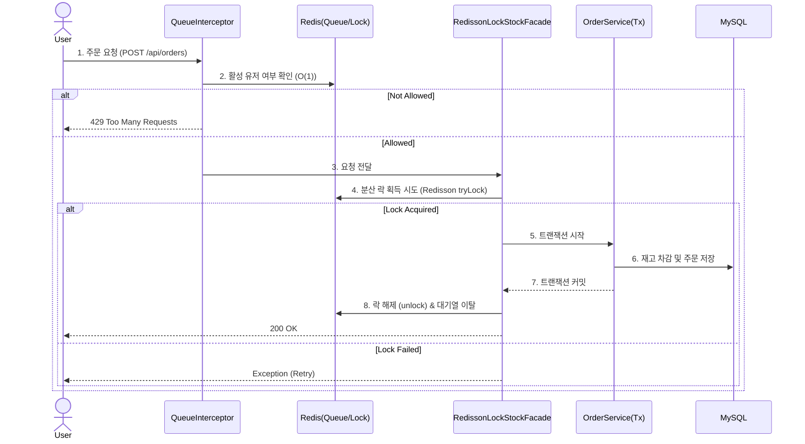

# 🛒 E-Shop Refactoring (High-Traffic Backend)

> **"코로나 시절 겪었던 서버 터짐으로 인한 불편함"에 대한 궁금증을 코드로 해결해본 프로젝트**


## 📝 Project Intro
백엔드 개발자를 꿈꾸며 가장 고민했던 부분은 **"내가 짠 코드가 10만 명의 사용자가 동시에 눌러도 버틸 수 있을까?"**였습니다.
이 프로젝트는 기존의 단순한 쇼핑몰 로직을 **대규모 트래픽 환경**을 가정하여 리팩토링한 결과물입니다. 동시성 이슈로 재고가 안 맞거나, 쿼리가 느려 DB가 뻗는 상황을 직접 시뮬레이션하고, **Redis 분산 락**과 **No-Offset 페이징** 기술을 도입해 문제를 해결하는 과정에 집중했습니다.

## 🛠 Tech Stack
| Category | Technology | Description |
|---|---|---|
| **Language** | Java 17 | JDK 17 (LTS) |
| **Framework** | Spring Boot 3.x | Spring Security, JPA |
| **Database** | MySQL 8.0, Redis | Prod(MySQL), Cache/Lock(Redis) |
| **Testing** | JUnit5, Mockito | 통합 테스트 위주의 검증 |

## 🔥 Key Troubleshooting (치열했던 고민의 흔적들)

### 1. "DB 락을 걸었더니, 로그인조차 안 됩니다." (Redis 분산 락 도입)
* **상황:** 재고 정합성을 맞추기 위해 `Pessimistic Lock`(비관적 락)을 걸었습니다.
* **문제:** 주문 트래픽이 몰리자 DB 커넥션이 고갈되면서, 주문과 상관없는 **단순 상품 조회나 로그인 요청까지 타임아웃**이 발생하는 '장애 전파'를 목격했습니다.
* **해결:**
    * 락의 부하를 DB가 아닌 Redis가 감당하도록 **Redisson 분산 락**을 도입했습니다.
    * **Facade 패턴**을 적용해 비즈니스 로직 전후로 락을 제어하여, DB 트랜잭션을 최대한 짧게 유지했습니다.
* **결과:** DB 커넥션 풀을 5개로 제한한 테스트 환경에서도 **조회 API가 100% 성공**하는 것을 확인했습니다.

### 2. "Redis 대기열, 조회하다가 서버가 죽을 뻔했습니다." (자료구조 최적화)
* **상황:** 접속자 대기열을 `Sorted Set` 하나로 구현했습니다.
* **문제:** 매 요청마다 무거운 `ZRANK`(순위 조회) 명령어가 실행되니, 대기 인원이 늘어날수록 Redis CPU 사용량이 급증했습니다.
* **해결:**
    * **입장 가능한 유저는 `Set`으로 분리**했습니다. 이제 인터셉터는 O(logN)이 아닌 **O(1)**(`SISMEMBER`)로 입장 권한을 확인합니다.
    * 유저를 이동시킬 때도 `Pipeline`을 사용하여 네트워크 비용을 줄였습니다.

### 3. "데이터 50만 개, 뒷페이지 조회에 3초가 걸립니다." (No-Offset)
* **상황:** 일반적인 `Offset` 페이징으로 상품 목록을 구현했습니다.
* **문제:** 테스트 데이터를 50만 개 넣고 뒷페이지를 조회하니, 앞의 데이터를 다 읽고 버리는 방식(Offset) 때문에 쿼리가 매우 느려졌습니다.
* **해결:**
    * **No-Offset(Cursor-based)** 방식을 도입해, "마지막 조회 ID보다 작은 ID"를 조회하도록 변경했습니다.
* **결과:** 데이터 위치와 상관없이 항상 **일정한 조회 속도(약 10배 향상)**를 확보했습니다.

## 🏗 System Architecture (Order Flow)
데이터 정합성과 성능의 균형을 맞추기 위해 **대기열(Queue) - 파사드(Facade) - 서비스(Service)** 계층 구조를 적용했습니다.



## 🧪 Testing (검증)
"된다고 생각하는 것"과 "되는 것"은 다르기에, 모든 핵심 로직은 테스트로 증명했습니다.
* [x] **동시성 테스트:** 45명 동시 주문 시 재고 40개 정확히 소진 (성공)
* [x] **가용성 테스트:** DB 커넥션 고갈 시뮬레이션 (성공)
* [x] **성능 테스트:** 대용량 데이터 페이징 속도 비교 (성공)

## 💡 Retrospective (아쉬운 점)
* **SPOF 문제:** 현재 Redis가 다운되면 대기열과 락 기능이 마비됩니다. 추후 Redis 클러스터를 도입하거나 DB 락으로 자동 전환되는 Fallback 로직을 구현해보고 싶습니다.

## 🚀 Getting Started
```bash
# 1. Clone Repository
git clone https://github.com/your-repo/eshop-refact.git

# 2. Build
./gradlew build

# 3. Run (Local Profile)
java -jar build/libs/eshop-refact-0.0.1-SNAPSHOT.jar --spring.profiles.active=local
```