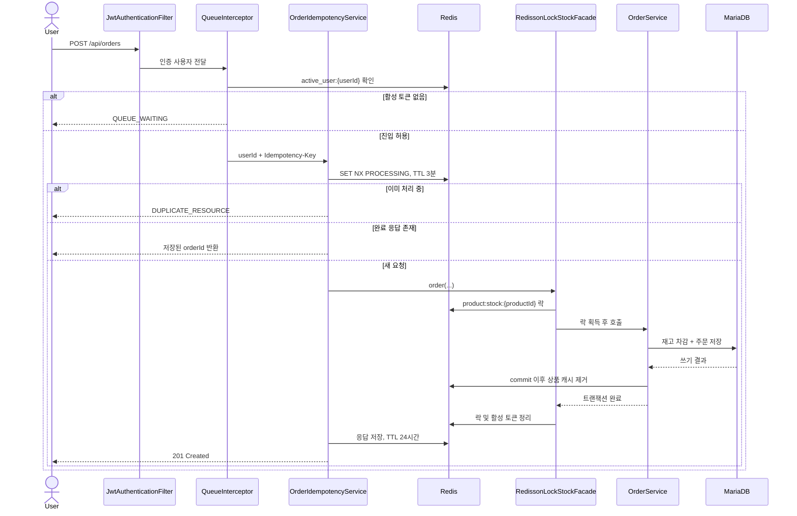

# 아키텍처 상세

README에서는 핵심 구조만 빠르게 파악할 수 있도록 요약하고, 이 문서에서 각 설계의 경계와 현재 구현 범위를 설명합니다.

## 설계 목표

E-Shop의 주문 경로는 다음 불변조건을 우선합니다.

1. 재고는 음수가 될 수 없고 실제 재고보다 많이 판매할 수 없다.
2. Redis 락 대기 중에는 DB 트랜잭션과 커넥션을 점유하지 않는다.
3. 같은 사용자의 동일 요청은 새 주문을 만들지 않는다.
4. 실패한 요청은 멱등성 점유 상태를 정리해 안전하게 재시도할 수 있다.
5. DB 커밋 전에는 상품 캐시를 제거하지 않는다.
6. 주문 취소 전에는 요청 사용자와 주문 소유자가 같은지 확인한다.

## 주문 생성 흐름



### 락과 트랜잭션 경계

`RedissonLockStockFacade`가 상품 ID 기반 락을 먼저 획득한 뒤 `OrderService.order()`를 호출합니다. DB 트랜잭션은 서비스 메서드에 있으므로 락을 기다리는 동안 HikariCP 커넥션을 점유하지 않습니다.

- 락 키: `product:stock:{productId}`
- 최대 대기 시간: 기본 10초
- 고정 lease: 기본 3초
- 해제 조건: 실제 획득했고 현재 스레드가 소유한 경우
- 인터럽트: `Thread.currentThread().interrupt()`로 상태 복구

고정 lease와 트랜잭션 timeout 정책의 추가 검토는 로드맵 [#12](https://github.com/juhwanz/eshop-refac/issues/12)에서 진행합니다.

### 멱등성 상태

```text
키 없음
  └─ SET NX 성공 → PROCESSING (3분)
       ├─ 주문 성공 → {"orderId": ...} (24시간)
       └─ 주문 실패 → 키 삭제 → 클라이언트 재시도 가능

동일 키 재요청
  ├─ PROCESSING → 중복 처리 오류
  └─ 완료 JSON → 기존 응답 반환
```

키 범위는 `idempotency:order:{userId}:{Idempotency-Key}`입니다. 현재 Redis 기반 구현이며 DB 멱등성 레코드와 장애 복구 정책은 [#13](https://github.com/juhwanz/eshop-refac/issues/13)의 범위입니다.

## 주문 취소

취소 요청은 주문에서 상품 ID를 찾고 같은 상품 락을 획득한 뒤 처리합니다. `OrderService.cancelOrder()`는 주문 소유권을 확인하고, 도메인 메서드 `Order.cancel()`을 통해 상태 변경과 재고 복구를 수행합니다.

재고가 바뀐 상품마다 `ProductCacheEvictEvent`를 발행하며, 실제 캐시 제거는 트랜잭션 커밋 이후에 수행됩니다.

## 대기열

대기열은 두 종류의 Redis 키를 사용합니다.

| 키 | 자료구조 | 역할 |
|---|---|---|
| `waiting_queue` | Sorted Set | 등록 시각을 score로 사용한 대기 순서 |
| `active_user:{userId}` | String, TTL 600초 | 주문 생성 경로 진입 허용 토큰 |

`QueueScheduler`는 1초마다 최대 100명을 활성화합니다. 한 번에 최대 1,000명씩 읽는 chunk와 Redis pipeline을 사용하며, ShedLock으로 다중 인스턴스의 중복 스케줄 실행을 막습니다.

`POST /api/orders/queue`는 `dev`, `test`, `local` 프로필에만 존재하는 PoC 지원 API입니다. 실제 운영 환경의 외부 대기열 시스템을 대신하는 완성형 인터페이스는 아닙니다.

## 캐시 정합성

상품 단건 조회는 `@Cacheable("products")`를 사용합니다. 상품 가격이나 재고가 변경되면 서비스는 캐시를 직접 지우지 않고 이벤트를 발행합니다.

```text
DB 변경 시도
  ├─ rollback → 이벤트 listener 실행 안 함 → 기존 캐시 유지
  └─ commit   → AFTER_COMMIT listener → products 캐시 제거
```

이 구조는 DB 변경이 실패했는데 캐시만 먼저 사라지는 순서 문제를 피합니다.

## 조회 전략

### 상품 목록

- Offset 방식: `Page<Product>`, 조건 검색과 전체 개수 제공
- No-Offset 방식: `id < lastProductId`, `id DESC`, `Slice<Product>`
- `pageSize + 1`건을 조회해 다음 페이지 존재 여부를 판단

No-Offset 커서는 마지막으로 받은 상품 ID입니다. 정렬 방향이 내림차순이므로 다음 요청은 이전 마지막 ID보다 작은 행을 조회합니다.

### 주문 목록

주문은 사용자별 `Page<Order>`로 조회하고 DTO 변환 과정에서 주문 항목을 읽습니다. 컬렉션 fetch join과 pageable을 결합하지 않고 Hibernate `default_batch_fetch_size=100`을 사용해 연관 컬렉션 조회를 IN 절 단위로 묶습니다.

## 인증과 토큰 생명주기

- Access Token과 Refresh Token을 분리하고 토큰 type claim을 확인합니다.
- Refresh Token은 `RT:{email}`에 14일 TTL로 저장합니다.
- 재발급 시 저장된 토큰과 비교한 뒤 새 Refresh Token으로 교체합니다.
- 로그아웃 시 Refresh Token을 제거하고 남은 Access Token 수명만큼 blacklist를 유지합니다.
- 상품 조회와 인증 진입 API 외의 요청은 기본적으로 인증이 필요합니다.
- 상품 등록과 가격 수정은 `ADMIN` 역할이 필요합니다.

## 관련 코드

- [OrderIdempotencyService](../src/main/java/com/project/eshop_refact/domain/order/OrderIdempotencyService.java)
- [RedissonLockStockFacade](../src/main/java/com/project/eshop_refact/domain/order/RedissonLockStockFacade.java)
- [OrderService](../src/main/java/com/project/eshop_refact/domain/order/OrderService.java)
- [WaitingQueueService](../src/main/java/com/project/eshop_refact/domain/queue/WaitingQueueService.java)
- [ProductCacheEventListener](../src/main/java/com/project/eshop_refact/domain/product/ProductCacheEventListener.java)
- [ProductRepositoryImpl](../src/main/java/com/project/eshop_refact/domain/product/ProductRepositoryImpl.java)
- [JwtAuthenticationFilter](../src/main/java/com/project/eshop_refact/global/security/JwtAuthenticationFilter.java)
