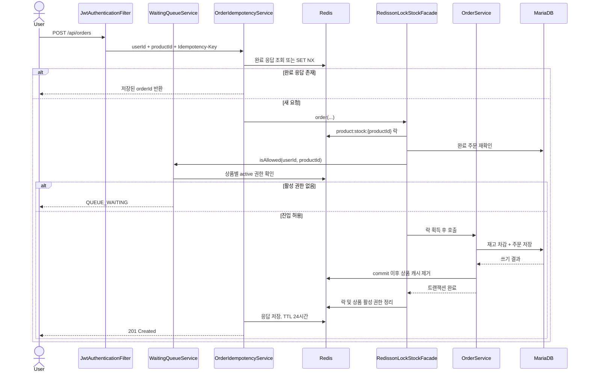

# 아키텍처 상세

README에서는 핵심 구조만 빠르게 파악할 수 있도록 요약하고, 이 문서에서 각 설계의 경계와 현재 구현 범위를 설명합니다.

## 설계 목표

E-Shop의 주문 경로는 다음 불변조건을 우선합니다.

1. 재고는 음수가 될 수 없고 실제 재고보다 많이 판매할 수 없다.
2. Redis 락 대기 중에는 DB 트랜잭션과 커넥션을 점유하지 않는다.
3. 같은 사용자의 동일 요청은 새 주문을 만들지 않는다.
4. 실패한 요청은 멱등성 점유 상태를 정리해 안전하게 재시도할 수 있다.
5. DB 커밋 전에는 상품 캐시를 제거하지 않는다.
6. 주문 취소 전에는 요청 사용자와 주문 소유자가 같은지 확인한다.

## 주문 생성 흐름



### 락과 트랜잭션 경계

`RedissonLockStockFacade`가 상품 ID 기반 락을 먼저 획득한 뒤 `OrderService.order()`를 호출합니다. DB 트랜잭션은 서비스 메서드에 있으므로 락을 기다리는 동안 HikariCP 커넥션을 점유하지 않습니다.

- 락 키: `product:stock:{productId}`
- 최대 대기 시간: 기본 10초
- lease: 지정하지 않고 Redisson watchdog으로 소유 중인 락을 갱신
- 해제 조건: 실제 획득했고 현재 스레드가 소유한 경우
- 인터럽트: `Thread.currentThread().interrupt()`로 상태 복구

watchdog과 DB 재고 제약의 결정은 [ADR-0004](adr/0004-protect-stock-with-watchdog-and-check.md)에 기록합니다.

### 멱등성 상태

```text
키 없음
  └─ SET NX 성공 → PROCESSING (3분)
       ├─ 주문 성공 → {"orderId": ...} (24시간)
       └─ 주문 실패 → 키 삭제 → 클라이언트 재시도 가능

동일 키 재요청
  ├─ PROCESSING → 중복 처리 오류
  └─ 완료 JSON → 기존 응답 반환
```

키 범위는 `idempotency:order:{userId}:{Idempotency-Key}`입니다. Redis는 완료 응답 캐시이고, DB의 `(user_id, idempotency_key)` 유일 제약과 저장된 결과가 최종 방어선입니다. 세부 결정은 [ADR-0005](adr/0005-persist-order-idempotency-in-database.md)에 기록합니다.

## 주문 취소

취소 요청은 주문에서 상품 ID를 찾고 같은 상품 락을 획득한 뒤 처리합니다. `OrderService.cancelOrder()`는 주문 소유권을 확인하고, 도메인 메서드 `Order.cancel()`을 통해 상태 변경과 재고 복구를 수행합니다.

재고가 바뀐 상품마다 `ProductCacheEvictEvent`를 발행하며, 실제 캐시 제거는 트랜잭션 커밋 이후에 수행됩니다.

## 대기열

대기열은 상품 범위가 드러나는 Redis 키와 대기 상품 인덱스를 사용합니다.

| 키 | 자료구조 | 역할 |
|---|---|---|
| `queue:{productId}:waiting` | Sorted Set | `INCR` sequence를 score로 사용한 상품별 FIFO |
| `queue:{productId}:sequence` | String | 같은 시각에도 순서를 결정하는 단조 증가 번호 |
| `queue:{productId}:active` | Sorted Set | 사용자별 활성 권한과 만료 시각 |
| `queue:waiting-products` | Sorted Set | 대기자가 있는 상품을 bounded하게 순환 처리 |

등록은 `POST /api/products/{productId}/queue`, 상태와 순번 조회는 같은 경로의 `GET`을 사용하며 모두 인증이 필요합니다. 상품이 존재해야 등록할 수 있고, 같은 상품에 중복 등록해도 새 sequence를 발급하지 않습니다.

`QueueScheduler`는 대기 상품과 각 상품의 선두 사용자를 설정된 개수만큼 읽습니다. waiting 제거와 active 권한 발급은 Lua로 원자화하고 ShedLock으로 다중 인스턴스의 중복 스케줄 실행을 막습니다. 활성 권한은 입장 속도 제어이며 동시 실행 수를 보장하지 않습니다. 세부 결정과 Redis Cluster 제약은 [ADR-0007](adr/0007-use-product-scoped-redis-admission-queue.md)에 기록합니다.

## 캐시 정합성

상품 단건 조회는 `@Cacheable("products")`를 사용합니다. 상품 가격이나 재고가 변경되면 서비스는 캐시를 직접 지우지 않고 이벤트를 발행합니다.

```text
DB 변경 시도
  ├─ rollback → 이벤트 listener 실행 안 함 → 기존 캐시 유지
  └─ commit   → AFTER_COMMIT listener → products 캐시 제거
```

이 구조는 DB 변경이 실패했는데 캐시만 먼저 사라지는 순서 문제를 피합니다.

## 조회 전략

### 상품 목록

- Offset 방식: `Page<Product>`, 조건 검색과 전체 개수 제공
- No-Offset 방식: `id < lastProductId`, `id DESC`, `Slice<Product>`
- `pageSize + 1`건을 조회해 다음 페이지 존재 여부를 판단

No-Offset 커서는 마지막으로 받은 상품 ID입니다. 정렬 방향이 내림차순이므로 다음 요청은 이전 마지막 ID보다 작은 행을 조회합니다.

### 주문 목록

주문은 사용자별 `Page<Order>`로 조회하고 DTO 변환 과정에서 주문 항목을 읽습니다. 컬렉션 fetch join과 pageable을 결합하지 않고 Hibernate `default_batch_fetch_size=100`을 사용해 연관 컬렉션 조회를 IN 절 단위로 묶습니다.

## 인증과 토큰 생명주기

- Access Token과 Refresh Token을 분리하고 토큰 type claim을 확인합니다.
- 로그인 실패는 계정별로 기록하며 연속 5회 실패 시 기본 15분 동안 임시 잠금합니다. 잠금 상태는 별도 트랜잭션과 사용자 행 락으로 갱신하고 만료 후 자동으로 새 시도를 허용합니다. 세부 결정은 [ADR-0006](adr/0006-use-temporary-login-lockout.md)에 기록합니다.
- 사용자 없음, 비밀번호 불일치, 잠금과 비활성 상태는 로그인 API에서 같은 실패 응답으로 처리합니다.
- Refresh Token은 `RT:{email}`에 14일 TTL로 저장합니다.
- 재발급 시 저장된 토큰과 비교한 뒤 새 Refresh Token으로 교체합니다.
- 로그아웃 시 Refresh Token을 제거하고 남은 Access Token 수명만큼 blacklist를 유지합니다.
- 상품 조회와 인증 진입 API 외의 요청은 기본적으로 인증이 필요합니다.
- 상품 등록과 가격 수정은 `ADMIN` 역할이 필요합니다.

## 관련 코드

- [OrderIdempotencyService](../src/main/java/com/project/eshop_refact/domain/order/OrderIdempotencyService.java)
- [RedissonLockStockFacade](../src/main/java/com/project/eshop_refact/domain/order/RedissonLockStockFacade.java)
- [OrderService](../src/main/java/com/project/eshop_refact/domain/order/OrderService.java)
- [WaitingQueueService](../src/main/java/com/project/eshop_refact/domain/queue/WaitingQueueService.java)
- [ProductCacheEventListener](../src/main/java/com/project/eshop_refact/domain/product/ProductCacheEventListener.java)
- [ProductRepositoryImpl](../src/main/java/com/project/eshop_refact/domain/product/ProductRepositoryImpl.java)
- [JwtAuthenticationFilter](../src/main/java/com/project/eshop_refact/global/security/JwtAuthenticationFilter.java)
